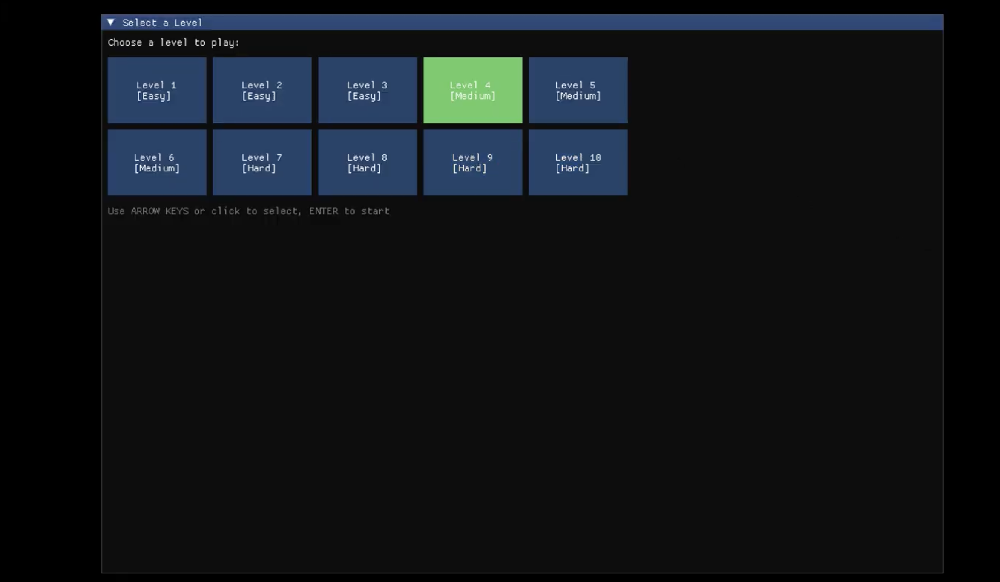
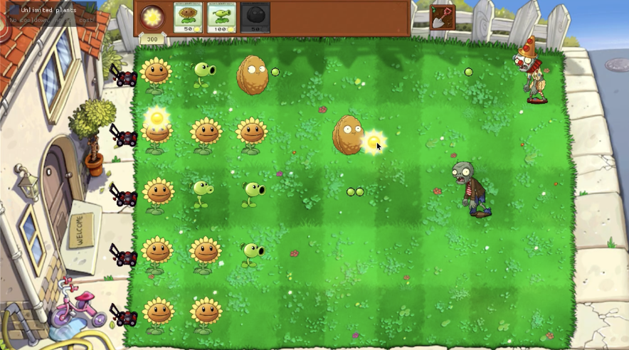
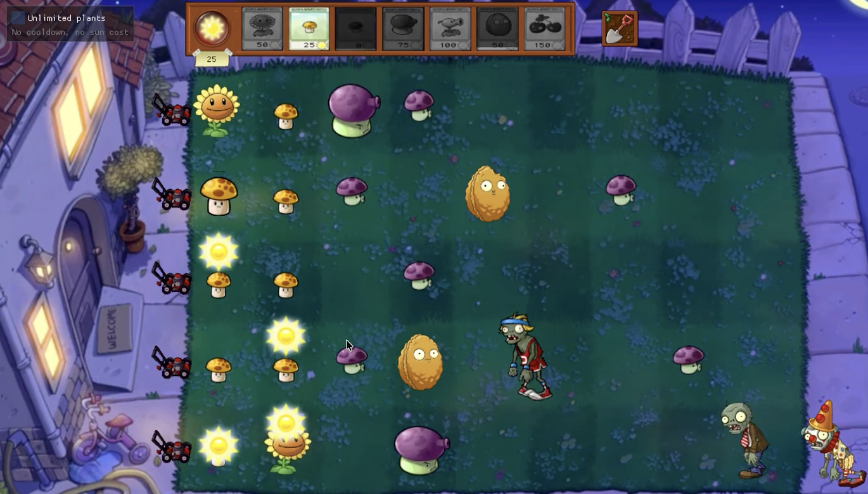
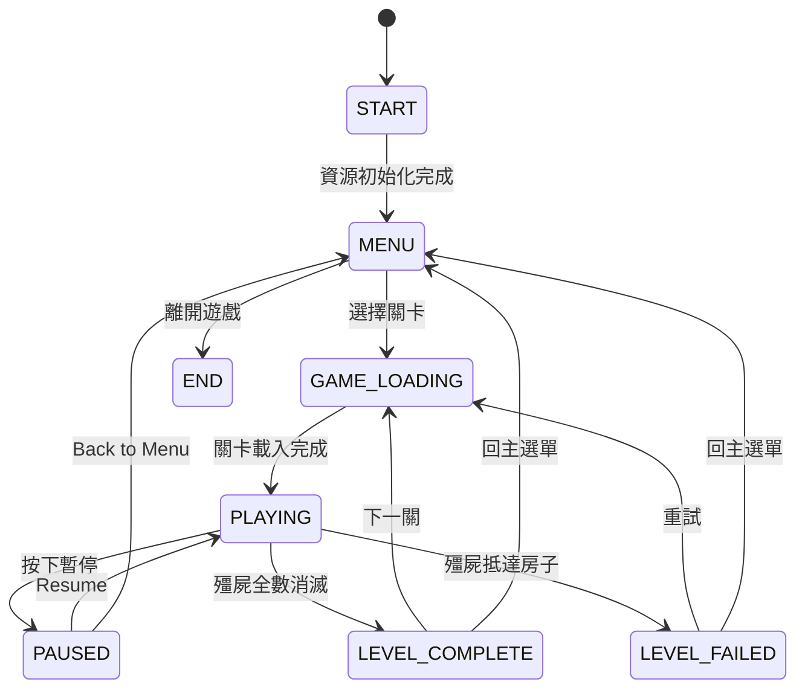
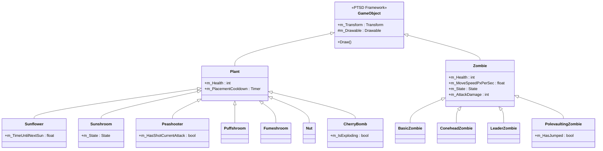
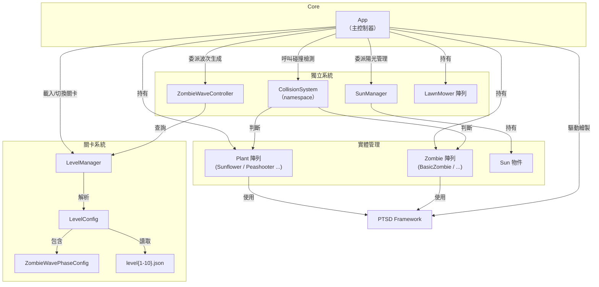

# 2026 OOPL Final Report

## 組別資訊

組別：第50組

組員：

- 111590035 李彥勲
- 111590022 丁勇智

復刻遊戲：
Plants vs. Zombies（植物大戰殭屍）

## 專案簡介
### 遊戲簡介
本專案以《Plants vs. Zombies（植物大戰殭屍）》作為復刻主題。玩家需利用陽光資源購買植物並放置於草地上，透過不同植物的能力抵擋殭屍入侵。
遊戲包含多種植物、殭屍、關卡與波次系統，並透過資料驅動方式管理關卡內容，使後續新增關卡與調整平衡更加方便。

主要還原的項目有：
- 核心格子放置系統：5×9 格子座標
- 陽光資源系統：初始陽光由關卡 JSON 設定。
- 植物：  
  - Peashooter
  - Sunflower
  - CherryBomb
  - 夜間專用與近戰型：Puffshroom、Fumeshroom
  - 路障：Nut
  - 冷卻機制
- 殭屍：
  - Basic
  - Conehead
  - Leader（持旗）
  - Polevaulting（撐竿跳）
  
  通用基底為 `Zombie`，具有狀態機（Walking/Attacking/Dying）與移動、攻擊邏輯。  
- 碰撞與戰鬥判定：同列 AABB 檢查由 CollisionSystem提供；殭屍選擇最近目標並攻擊。  
- 關卡與波次資料化：關卡與波次由 JSON 驅動，支援 `startDelaySec`、`repeat`、`zombiesPerWave`、`waitUntilClear` 等參數；`LevelManager` 負責載入與進度管理。  
- 動畫資源處理：以 GIF 拆成 frame PNG 再用 Util::Animation 播放，並以不同 frame sets 驅動 idle/attack/dying 動畫。  
- UI / 調試工具：ImGui 整合與 debug 設定，並提供 cheat 工具（如無限植物、冷卻 bypass）以利測試。  
- 遊戲流程與狀態：主迴圈在 main.cpp，`App` 管理遊戲狀態（START → MENU → PLAYING → LEVEL_COMPLETE / LEVEL_FAILED → END），包含 Game Over 與關卡完成判定。  
- 日夜場景差異：關卡 JSON 的 sceneType 支援日/夜。

### 組別分工
#### 李彥勲（111590035）

- 夜間植物系統開發
- Sunshroom（陽光菇）功能實作
- Puffshroom（小噴菇）功能實作
- 植物卡片與冷卻機制調整
- Branch 測試與功能整合
- Bug 修正與遊戲測試

#### 丁勇智（111590022）

- 底層架構建立
- 關卡系統設計與調整
- 波次（Wave）設定
- 殭屍數值平衡調整
- 關卡流程測試
- Bug 修正與功能驗證

## 遊戲介紹
玩家要在自己的庭院種植各種植物來防守，阻止一波又一波的殭屍走進房子吃掉大腦。
### 遊戲規則
#### 收集陽光
陽光是遊戲中的資源。
可以靠天上掉落的陽光或向日葵生產。
#### 種植植物
使用陽光購買植物。
不同植物有不同功能：
- 攻擊（豌豆射手）
- 防禦（堅果牆）
- 爆炸（櫻桃炸彈）
- 生產陽光（向日葵）
#### 抵擋殭屍
殭屍會從右側慢慢往左前進。
如果殭屍走進房子，玩家失敗。
#### 策略配置
根據不同殭屍種類選擇適合的植物。
合理安排前排防禦、後排輸出和陽光生產。
#### 最後防線
每排草地左端設有一輛割草機，作為最後一道防線。當殭屍碰觸割草機時，割草機會自動啟動並向右疾衝，一次性消滅該排所有殭屍；但每排僅有一輛，使用後即消失。
#### 勝利條件
撐過所有殭屍進攻波次即可過關。

### 遊戲畫面

關卡選擇介面

遊戲中

夜間遊玩畫面

## 程式設計

### 程式架構
本專案主要採用物件導向設計（Object-Oriented Programming）。

#### 遊戲狀態機

#### 類別繼承架構

#### 模組關係

主要模組如下：

#### App

遊戲主控制器，持有所有遊戲狀態，驅動全部系統：
- 初始化資源
- 遊戲更新
- 玩家操作
- 場景管理

`App` 透過狀態機管理流程:
- `START`: 初始化資源、建立 `LevelManager`/`MenuScene`
- `MENU`: 顯示關卡選擇
- `GAME_LOADING`: 載入關卡並重置場景
- `PLAYING`: 正常戰鬥更新
- `PAUSED`: 遊戲暫停，顯示暫停選單（Resume / Back to Menu）
- `LEVEL_COMPLETE`: 過關 UI 與下一關/回選單
- `LEVEL_FAILED`: 失敗 UI 與重試/回選單
- `END`: 結束遊戲

#### Plant

植物基底類別。

所有植物皆繼承 Plant 類別，例如：

- Sunflower
- Peashooter
- CherryBomb
- Puffshroom
- Sunshroom
- Nut

#### Zombie

殭屍基底類別。

所有殭屍皆繼承 Zombie 類別，例如：

- BasicZombie
- ConeheadZombie
- LeaderZombie
- PolevaultingZombie

#### LevelManager

負責：

- 關卡載入
- 關卡切換
- 波次管理

#### LevelConfig

- 透過 JSON 讀取關卡設定，配合 LevelManager。

#### WaveConfig

- 管理殭屍生成波次，配合 LevelManager。

#### SunManager

- 擁有所有陽光物件，掉落、植物產生、收集動畫、計時。

#### CollisionSystem

- 被單獨拆出的碰撞系統，所有碰撞檢測集中於此。
- 可以自定義碰撞盒在物件上的大小、位置

### 對 PTSD 框架的 Override

本專案對 PTSD 框架進行了三處 Override，以支援遊戲所需的進階功能。Override 檔案存放於 `ptsd_overrides/` 目錄，並透過 CMake 的 `configure_file` 在建置時自動複製至 PTSD 原始碼目錄，取代對應的框架檔案。

#### 1. `Util::Renderer`（`Renderer.hpp` / `Renderer.cpp`）

**新增：世界座標平移（`SetTranslation` / `m_Translation`）**

原始 PTSD 的 `Renderer` 只能以物件本身的絕對座標進行繪製，無法對整個場景套用偏移。

Override 版本新增了 `SetTranslation(glm::vec2)` 方法與 `m_Translation` 成員變數。在 `Update()` 繪製每個子物件時，會將此平移量加到物件的世界座標上，繪製完畢後再還原，不影響物件本身儲存的座標值。

此機制用於實作鏡頭推移動畫：關卡開始時，鏡頭從地圖右側平移至中央，透過呼叫 `m_Root.SetTranslation({m_CameraCurrentX, kCameraOffsetY})` 實現整個場景的同步移動。

#### 2. `Util::Image`（`Image.hpp` / `Image.cpp`）

**新增：Tint 著色與填充進度（用於植物卡片 UI）**

原始 PTSD 的 `Image` 只能以原始紋理顏色繪製，無法動態改變顏色或顯示部分填充效果。

Override 版本新增了三個功能：

| 方法 | 說明 |
| --- | --- |
| `SetTintColor(glm::vec4)` | 將整張圖片乘以指定的 RGBA 顏色，實現灰階或變色效果 |
| `SetFillProgress(float)` | 設定填充比例（0.0 = 空，1.0 = 滿），供 Shader 決定繪製範圍 |
| `SetShowFillProgress(bool)` | 切換是否啟用填充進度視覺化 |

這些功能用於**植物卡片冷卻 UI**：冷卻中的卡片透過 `SetShowFillProgress(true)` 顯示由下往上的亮暗分界，直觀呈現剩餘冷卻進度。

#### 3. `Base.frag`（Fragment Shader）

**新增：Tint 與填充進度的 GLSL 實作**

配合上述 `Image` 的 Override，Fragment Shader 新增了三個 Uniform 變數：

- `tintColor`：將最終片段顏色乘以此值，實現整體著色
- `fillProgress`：填充比例，範圍 0.0～1.0
- `showFillProgress`：是否啟用填充模式

當 `showFillProgress` 為 `true` 時，Shader 依據 UV 座標的 Y 值判斷目前片段位於填充區（下方）或未填充區（上方）：

- **填充區（已冷卻部分）**：顏色乘以 1.2 倍，略微增亮
- **未填充區（冷卻中部分）**：轉為灰階並乘以 0.5，視覺上呈現暗灰色遮罩

此更改讓植物卡片在冷卻期間能即時呈現「由下往上填滿」的動畫。

---

### 程式技術

#### 1. 物件導向設計

透過繼承與多型實作植物與殭屍系統。
新增新植物時只需繼承 Plant 類別即可。
新增新殭屍時只需繼承 Zombie 類別即可。

#### 2. 動畫系統

利用 GIF 動畫拆解成多張圖片並透過 Animation 系統播放。
使角色與植物具有動態效果。

#### 3. 關卡資料化

使用 JSON 儲存：
- 關卡資訊
- 殭屍波次
- 初始陽光
- 場景設定
方便後續擴充。

#### 4. 作弊模式
從畫面左上角開啟。
提供測試功能：
- 無限陽光
- 無冷卻時間
- 快速測試遊戲內容

---

### 使用到 AI／AI Agent 的部分

本專案開發過程中使用 GitHub Copilot 協助撰寫部分程式碼、除錯與程式重構。

根據需求檢查 Copilot 所提供之建議內容，並進行人工修改與測試驗證，以確保功能正確性與程式品質。

在專案的最後使用 claude code 進行程式碼重構輔助。

## 結語

### 問題與解決方法

**問題一：雙人開發工作流**

解決方法：利用 Git Branch 開發與合併機制進行版本管理。

**問題二：部分效果需要更改框架來實現**

解決方法：透過與 AI 的協作，提供建議並且建立 override 的方法及實作。

**問題三：剛開始建立的殭屍及植物皆以本身的素材作為碰撞判斷，但撐竿跳因此產生問題（素材本身寬度寬）**

解決方法：建立碰撞盒來管理碰撞的邏輯，並且加入是否在同一列的判斷避免跨列碰撞。

**問題四：關卡的建立**

解決方法：植物大戰殭屍的關卡具有重複性，差異在於殭屍的種類、數量及陽光的獲取量。因此建立 LevelManager 以及 LevelConfig 來做關卡設定達到降低重複程式碼的目的。

### 自評

| 項次 | 項目                   | 完成 |
|------|------------------------|-------|
| 1    | 這是範例 |  V  |
| 2    | 完成專案權限改為 public |  V  |
| 3    | 具有 debug mode 的功能  |  V  |
| 4    | 解決專案上所有 Memory Leak 的問題  |  V  |
| 5    | 報告中沒有任何錯字，以及沒有任何一項遺漏  |  V  |
| 6    | 報告至少保持基本的美感，人類可讀  |  V  |

### 心得
這次專案選擇了小時候很常玩的《Plants vs. Zombies（植物大戰殭屍）》作為主題。為了復刻這個遊戲，我們重新遊玩了幾次，然後針對遊戲內的植物、殭屍都做了更多的深入研究，就像在研究攻略一樣，緩醒了很多回憶。

雖然遊戲的機制沒有很難，但實作時還是面臨到不少的問題，從來沒有想過要完成一個遊戲需要花那麼多的時間那麼多的程式碼，也因為這個專案對於物件導向有了更深入的理解，從原先的理論課程到這學期的實作，加深了我們非常多的印象。

我們嘗試了很多 AI 語言模型，或是如 Claude code 這樣的程式輔助 AI。這個專案不只讓我們對程式架構有更深入的理解，也明白了 AI 在現在這個時代作為輔助工具的重要性，以及我們作為下一代軟體開發者所需要的技能。

### 貢獻比例

| 組員             | 貢獻比例 |
| -------------- | ---- |
| 李彥勲（111590035） | 40%  |
| 丁勇智（111590022） | 60%  |